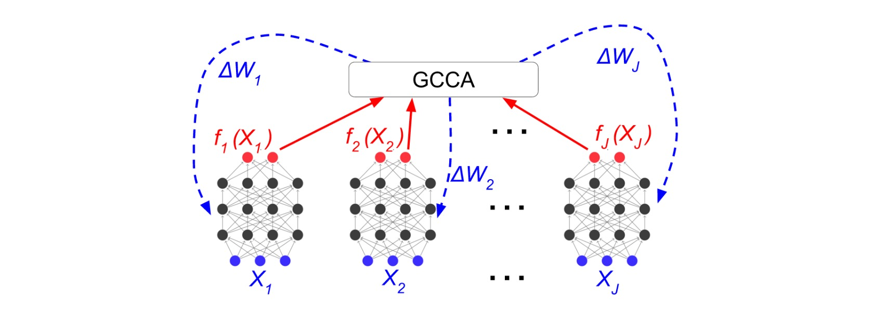
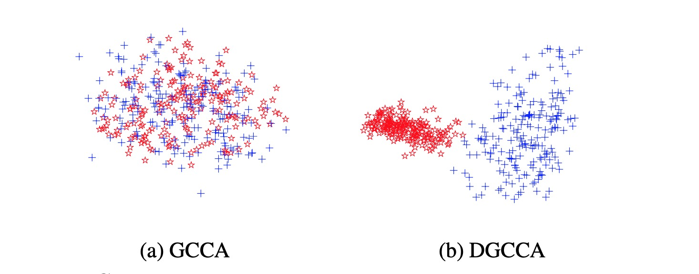
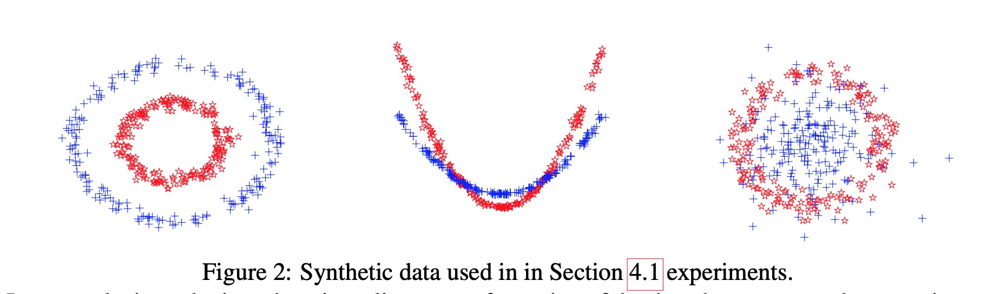
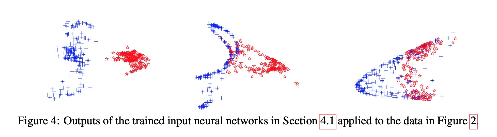

# DGCCA-pytorch:

A Pytorch Implementation of Deep Generalized Canonical Correlation Analysis as described in:

Adrian Benton, Huda Khayrallah, Biman Gujral, Dee Ann Reisinger, Sheng Zhang, and Raman Arora. Deep Generalized Canonical Correlation Analysis. The 4th Workshop on Representation Learning for NLP. 2019
[(Paper-link)](https://www.aclweb.org/anthology/W19-4301/)

# Deep Generalized Canonical Correlation Analysis:

*Generalized Canonical Correlation Analysis (GCCA)* is a method which corresponds to solving an optimization problom objective to find the best linear shared space called ***G*** for the *J* view of a data

**DeepGCCA** is a non-linear version of GCCA which uses neural networks as the feature extractor functions instead of linear transformers. ***DGCCA*** is some how exention of ***DeepCCA*** for more than two views though it has a different objective function.

 - figures source [Deep Generalized Canonical Correlation Analysis - Arxiv 1702.02519](https://arxiv.org/abs/1702.02519)

# Example:

Synthatic Data: [(synth data generator)](/synth_data.py)

DGCCA Latent space for views:

 - figures source [Deep Generalized Canonical Correlation Analysis - Arxiv 1702.02519](https://arxiv.org/abs/1702.02519)

# Prerequest:

- Python 3.6>=
- Pytorch 1.4 >= (should also work with >=1.0)
- Numpy
- Scipy
- Seanborn

# Other Implementations:

 - [Theano Implementation](https://bitbucket.org/adrianbenton/dgcca-py3/src/master/) By Adiran Benton.
 
 
 ## Notes:
 
 ### check list:
 
 - cuda test
 - different Batch sizes
 
 ### to do: 
 
 - Nan gradient/update rules (Famous issue of Deep CCA - based models, like [DeepCCA Nan outputs]()
 - More numerical stabilization for varient Architectures
 
 Warmest thanks to Mr. Adrian Benton for his kind helps.
